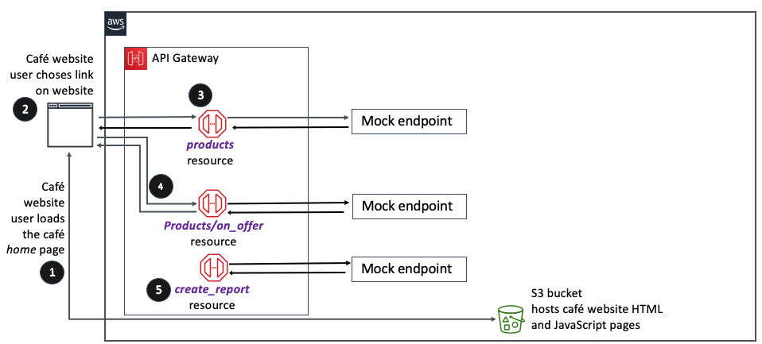

# Developing REST APIs with Amazon API Gateway

In the previous [project](https://github.com/oulanikkinen/aws-working-with-dynamodb), I took on the role of Sofía to build a web application for the café. As part of this process, I created an Amazon DynamoDB table that was named FoodProducts, where we stored information about café menu items. I then loaded data that was formatted in JavaScript Object Notation (JSON) into the database table. The table structure looked similar to the following table (one line item of table data is shown as an example):

| product_name | description | price_in_cents | product_id | tags | special |
|---|---|---|---|---|---|
| apple pie slice | A delicious slice of Frank's homemade pie. | 595 | a444 | [ { "S" : "pie slice" }, { "S" : "on offer" } ] | 1 |

In the previous [project](https://github.com/oulanikkinen/aws-working-with-dynamodb) I also configured code that used the AWS SDK for Python (Boto3) to:

- Scan a DynamoDB table to retrieve product details.
- Return a single item by product name using get-item as a proof of concept
- Create a Global Secondary Index (GSI) called special_GSI that you could use to filter out menu items that are on offer and not out of stock.

In this project, I will continue to play the role of Sofía and use Amazon API Gateway to configure mock data endpoints. There are three that I will create:

- [GET] /products (which will eventually invoke a DynamoDB table scan)
- [GET] /products/on_offer (which will eventually invoke a DynamoDB index scan and filter)
- [POST] /create_report (which will eventually trigger a batch process that will send out a report)

(Then in the project (coming soon) that follows this one, I will replace the mock endpoints with real endpoints, so that the web application can connect to the DynamoDB backend.

By the end of this lab, I have created the following architecture (below):
The full documentation you can find [here](restapi.ipynb).

